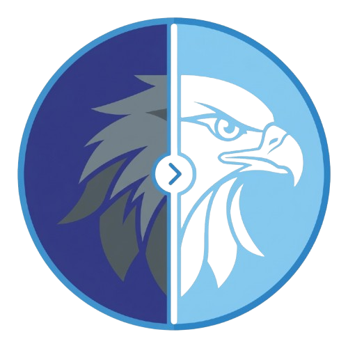
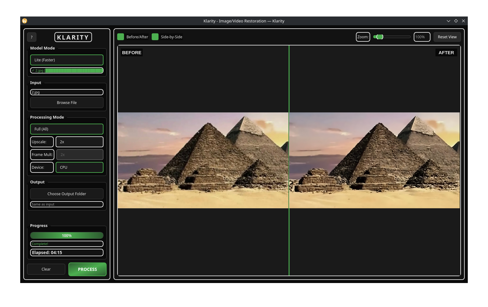
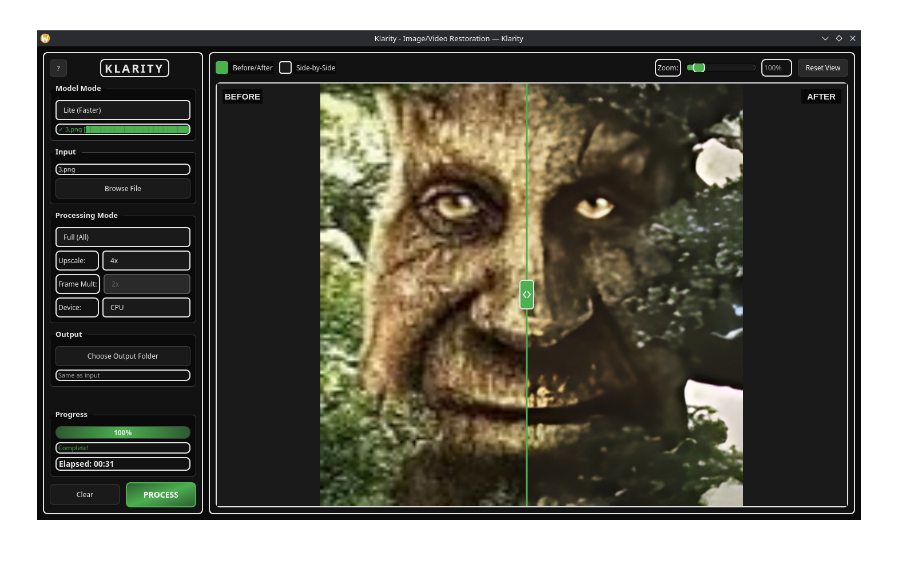
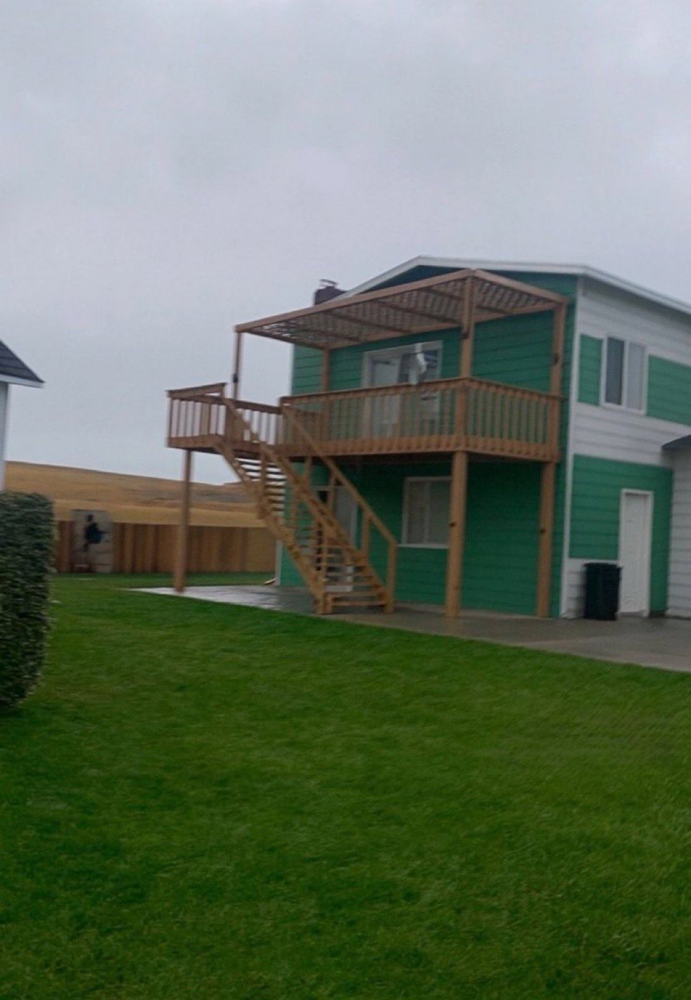
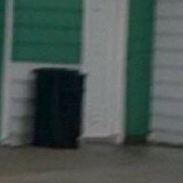
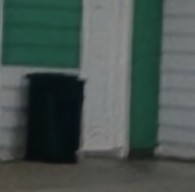
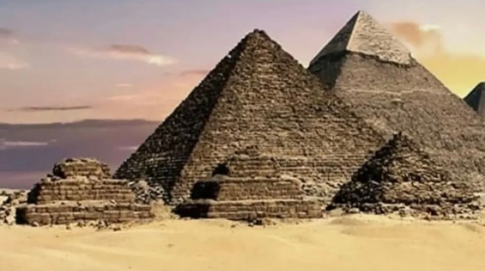
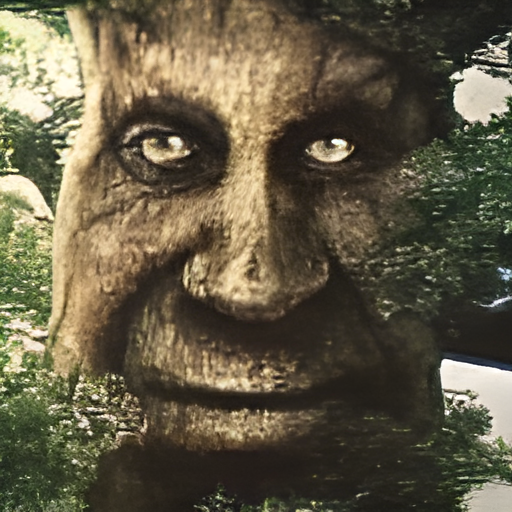

# Klarity - AI Image/Video Restoration

<p align="center">
  
</p>

<p align="center">
  <a href="https://colab.research.google.com/drive/14AaMnyz5sBuky2yOk-QmDhYtkh9V7o-3?usp=sharing">
    
  </a>
  <a href="https://huggingface.co/spaces/HAKORADev/Klarity">
    
  </a>
</p>

**Klarity** is a local, free, offline AI-powered image and video restoration tool that delivers professional-grade denoising, deblurring, upscaling, and frame generation. Built for creators, editors, and anyone who needs to enhance visual content without subscription fees.

🤖 **For AI agents and automated tools:** See [Bots.md](Bots.md)

---

## Quick Start

### Run from Source
```bash
# Clone the repository
git clone https://github.com/HAKORADev/Klarity.git
cd Klarity

# Install dependencies
pip install -r requirements.txt

# Launch GUI
python src/klarity.py

# Or use CLI mode
python src/klarity.py cli
```

### Installation Requirements
```bash
# Install FFmpeg (required for video processing)
# Windows: winget install FFmpeg
# macOS: brew install ffmpeg
# Linux: sudo apt install ffmpeg
```

---

## Core Capabilities

### 🎨 **9 Processing Modes**

Klarity offers nine distinct processing modes, each designed for specific enhancement needs:

| Mode | Description | Input | Output |
|------|-------------|-------|--------|
| **Denoise** | Remove noise from images/videos | Image/Video | Image/Video |
| **Deblur** | Remove blur from images/videos | Image/Video | Image/Video |
| **Upscale** | 2x or 4x upscaling | Image/Video | Image/Video |
| **Clean** | Denoise + Deblur pipeline | Image/Video | Image/Video |
| **Full** | Denoise + Deblur + Upscale | Image/Video | Image/Video |
| **Frame-Gen** | AI frame interpolation | Video | Video (higher FPS) |
| **Clean-Frame-Gen** | Clean + Frame generation | Video | Video |
| **Full-Frame-Gen** | Full pipeline + Frame generation | Video | Video |

---

### ⚡ **Dual Model Modes**

| Mode | Models | Download | Quality | Speed |
|------|--------|----------|---------|-------|
| **Heavy** (default) | NAFNet-width64, RealESRGAN-x4plus, RIFE v4.25 | ~785 MB | Best | Slower |
| **Lite** | NAFNet-width32, RealESRGAN-general-x4v3, RIFE v4.17 | ~204 MB | Good | Faster |

#### Performance Comparison

| Metric | Lite Mode | Heavy Mode |
|--------|-----------|------------|
| **Hardware Demand** | 🟢 **13x less demanding** | 🔴 Baseline |
| **Processing Speed** | 🟢 **20x faster** | 🔴 Baseline |
| **Quality Loss** | 🟡 ~20-28% quality trade-off | 🟢 Maximum quality |
| **Minimum RAM** | 🟢 **4GB RAM** | 🔴 **8-16GB RAM** |
| **Best For** | Quick previews, low-end systems | Final output, maximum fidelity |

> 💡 **Pro Tip:** Use **Lite mode** for rapid iteration and previewing, then switch to **Heavy mode** for your final export.

---

### 🔧 **AI Model Integration**

Klarity leverages state-of-the-art open-source models for professional-grade restoration:

- **Denoising:** [NAFNet-SIDD](https://github.com/megvii-research/NAFNet) — Neural networks for noise reduction
- **Deblurring:** [NAFNet-GoPro](https://github.com/megvii-research/NAFNet) — Motion blur removal
- **Upscaling:** [Real-ESRGAN](https://github.com/xinntao/Real-ESRGAN) — 4x super-resolution
- **Frame Generation:** [RIFE](https://github.com/hzwer/Practical-RIFE) — AI frame interpolation

---

## Usage Guide

### GUI Mode

1. Launch: `python src/klarity.py`
2. Drag & drop files or click Browse
3. Select processing mode from dropdown
4. Choose model mode (Heavy/Lite)
5. Set upscale factor (2x or 4x) if applicable
6. Click **"Process"**
7. Preview results with comparison slider
8. Save output

### CLI Mode (Interactive)
```bash
python src/klarity.py cli
```

### CLI Mode (Direct)
```bash
# Image processing
python src/klarity.py deblur input.jpg -o output.jpg
python src/klarity.py denoise image.png
python src/klarity.py upscale photo.jpg --upscale 4
python src/klarity.py clean image.jpg        # denoise + deblur
python src/klarity.py full image.jpg         # full pipeline

# Video processing
python src/klarity.py frame-gen video.mp4 --multi 2
python src/klarity.py clean-frame-gen video.mp4 --multi 4
python src/klarity.py full-frame-gen video.mp4 --multi 2 --upscale 2

# Lite mode (faster)
python src/klarity.py -lite full image.jpg
```

---

## System Requirements

| Component | Minimum | Recommended |
|-----------|---------|-------------|
| **CPU** | 2 cores | 4+ cores |
| **RAM** | 4GB | 16GB+ |
| **GPU** | None (CPU works) | NVIDIA GTX 1060+ |
| **VRAM** | N/A | 4GB+ |
| **Storage** | 2GB | SSD recommended |

**Note:** Klarity works on CPU. GPU with CUDA significantly speeds up processing.

---

## Supported Formats

### Images
`.jpg`, `.jpeg`, `.png`, `.bmp`, `.tiff`, `.tif`, `.webp`

### Videos
`.mp4`, `.avi`, `.mov`, `.mkv`, `.webm`, `.flv`, `.wmv`, `.m4v`

---

## 🎬 Showcase

### Graphical User Interface

<p align="center">
  
  
</p>

---

### Clean Mode (Denoise + Deblur)

<p align="center">
  
</p>

<p align="center">
  
  
</p>

<p align="center"><i>Left: Original (zoomed) — Right: Cleaned with Lite mode (zoomed)</i></p>

---

### 2x Upscale (Full-Lite Mode)

<p align="center">
  
  
</p>

<p align="center"><i>Left: Original — Right: 2x Upscale (Full-Lite mode)</i></p>

---

### 4x Upscale: Lite vs Heavy

<p align="center">
  
</p>

<p align="center">
  
  
</p>

<p align="center"><i>Left: 4x Upscale (Full-Lite) — Right: 4x Upscale (Full-Heavy)</i></p>

---

### Frame Generation: 15FPS → 60FPS

<p align="center">
  <video src="https://github.com/user-attachments/assets/f777aed7-7af1-4240-9229-3c1e97867758" controls muted width="80%"></video>
</p>

<p align="center">
  <i>Left: 15FPS gameplay (NFS Heat) — Right: x4 Clean Frame-Gen Heavy (60FPS) at 480p</i>
</p>

> 🎮 **Demo:** 15FPS gameplay video transformed to smooth 60FPS using Clean-Frame-Gen Heavy mode
> 
> Note: set playback speed to 0.25 to see the difference clearly

---

## Documentation

- **[Guide.md](Guide.md)** - Complete technical documentation
- **[CHANGELOG.md](CHANGELOG.md)** - Version history and changes
- **[Bots.md](Bots.md)** - For AI agents and automation

---

## License

Each component has its own license:
- NAFNet: Apache 2.0
- Real-ESRGAN: BSD 3-Clause
- RIFE: MIT
- Klarity: MIT

---

## Links

- **🤗 HuggingFace Space:** [Go To Demo Space](https://huggingface.co/spaces/HAKORADev/Klarity)
- **🧪 Google Colab:** [open Notebook](https://colab.research.google.com/drive/14AaMnyz5sBuky2yOk-QmDhYtkh9V7o-3?usp=sharing)

> 📝 **Note:** The HuggingFace demo uses **Lite models** and supports **image processing only**. For Heavy models and video support, use the **desktop version** or the **Google Colab notebook**, which provides the full experience with Heavy models and video processing — just like running it on a real PC except GUI is desktop-only.

---
